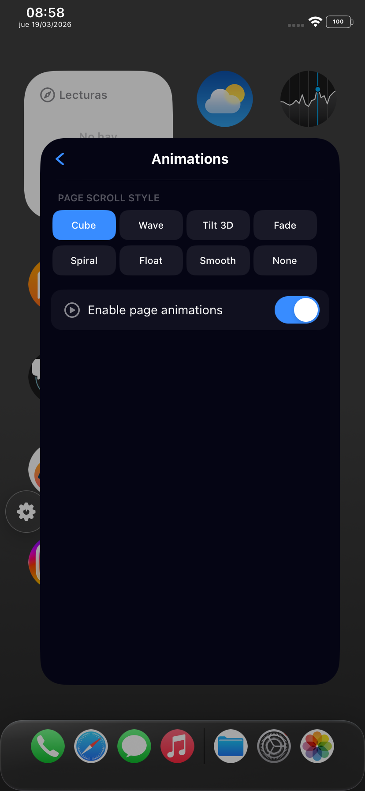
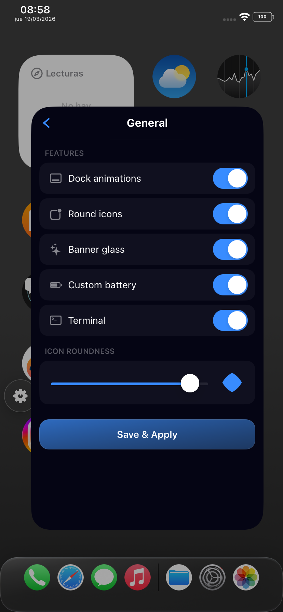
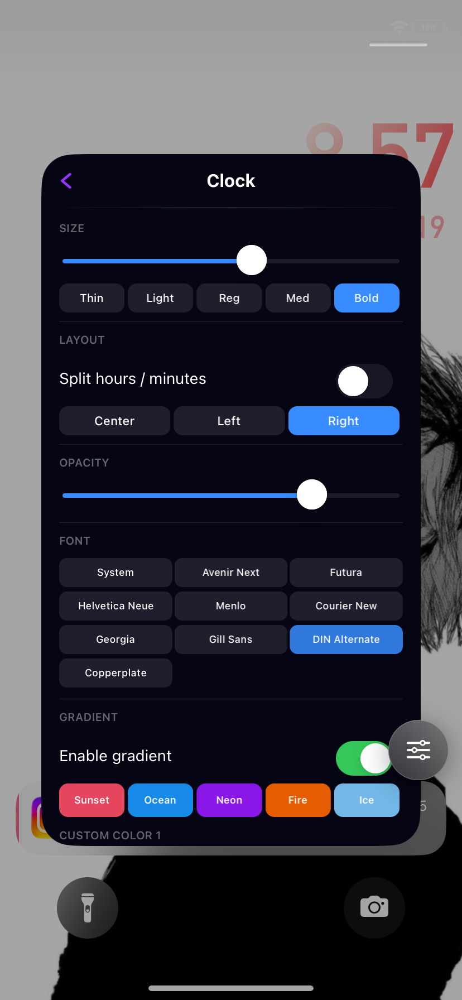
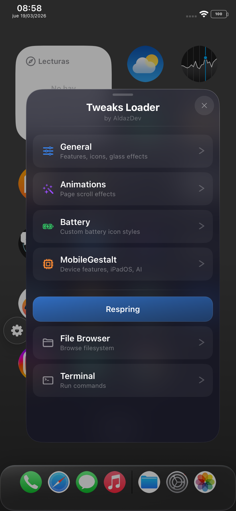
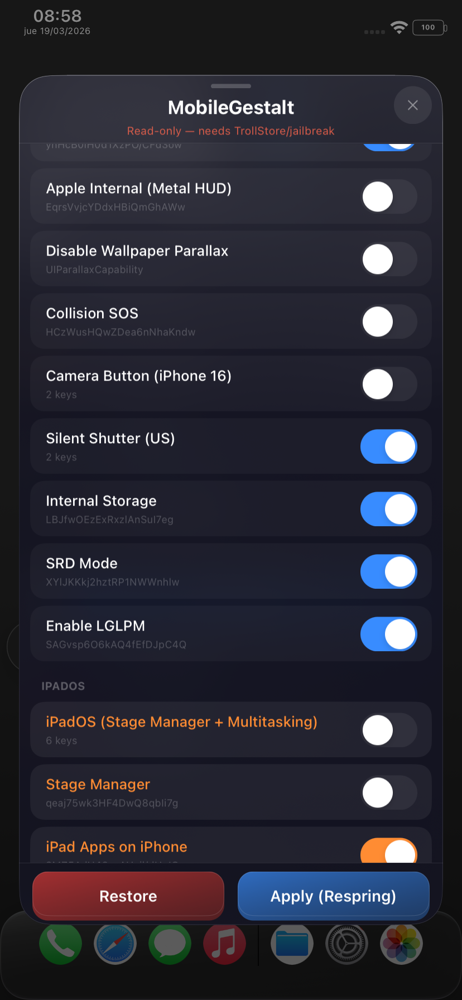
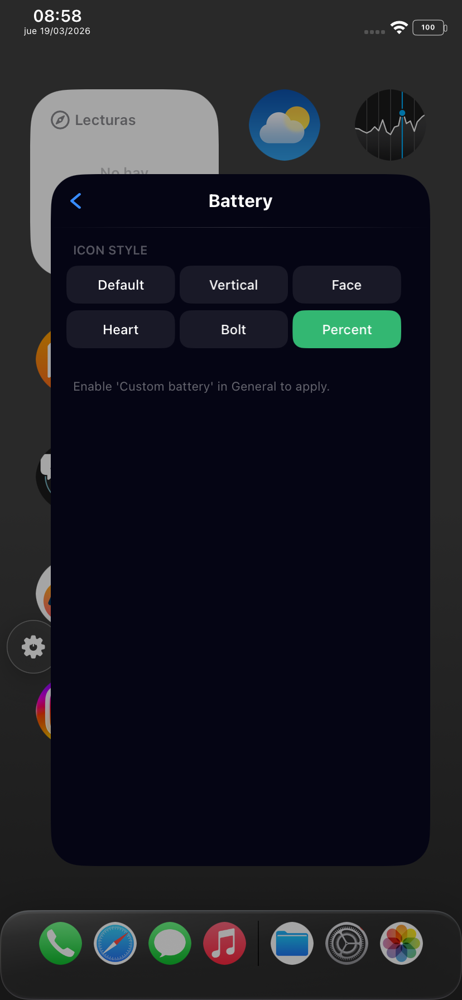
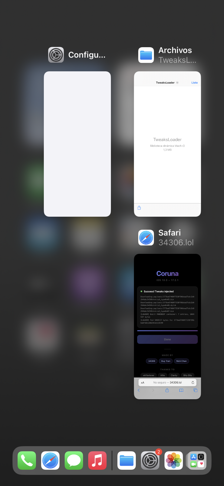
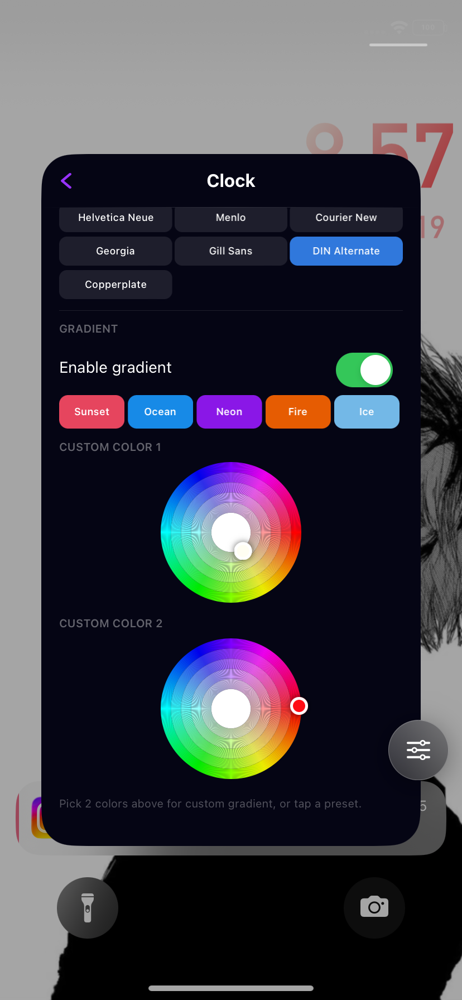

# TweaksLoader

Standalone tweak dylib for the **Corunna** exploit chain (iOS 13.0 – 17.2.1).  
No substrate, no ellekit — pure ObjC runtime hooking injected into SpringBoard.

---

## Preview

<table>
  <tr>
    <td></td>
    <td></td>
    <td></td>
    <td></td>
  </tr>
  <tr>
    <td></td>
    <td></td>
    <td></td>
    <td></td>
  </tr>
</table>

---

## Features

### Floating Dock
iPad-style floating dock on iPhone.

### Page Animations
8 home screen page-swipe animation styles — Cube, Wave, Tilt 3D, Fade, Spiral, Float, Smooth, None.

### Icon Roundness
Adjustable icon corner radius via slider.

### Custom Battery Styles
5 styles — Default, Vertical, Face, Kawaii, Heart, Bolt.

### Banner Glass
Liquid glass effect on notification banners.

### Lockscreen Customizer
Custom clock font, size, alignment, split mode, and date label.

### Control Center
Apple device info button and mini file browser injected into the CC overlay.

### Mini File Browser
Navigate the filesystem from SpringBoard. Read, edit, and save files — binary plists decoded to XML automatically. Long-press the floating button to open.

### Mini Terminal
SpringBoard-based terminal with native ObjC commands — no posix_spawn.  
`ls` `cd` `cat` `find` `grep` `echo` `ps` `env` `stat` `uname` `df` `head` `tail` `mkdir` `touch` `rm` `date` `whoami` `id` `neofetch` `clear` `pwd`  

### MobileGestalt Editor
Write directly to `com.apple.MobileGestalt.plist` from SpringBoard.

---

## Installation

Drop `TweaksLoader.dylib` into your Corunna dylib folder and inject into SpringBoard.

Requires **Corunna** or compatible exploit chain.  
iOS 13.0 – 17.2.1 | arm64

---

## Credits

Based on and inspired by:

- https://github.com/zeroxjf/Coruna-Tweaks-Collection — **zeroxjf**
- FloatingDockXVI — @EthanWhited  
- Cylinder Remade — @ryannair05  
- FiveIconDock — lunaynx  

### MobileGestalt Tweaks
- https://github.com/leminlimez — Nuget
- https://github.com/khanhduytran0 — SparseBox

### Additional
- Claude — collaboration & assistance

---

## Notes

- Source is not included for now. Binary only.
- MobileGestalt tweaks require a respring to apply.
- Stage Manager and iPadOS mode are marked risky — use with caution.
