# TweaksLoader

Standalone tweak dylib for the **Corunna** exploit chain (iOS 13.0 – 17.2.1).  
No substrate, no ellekit — pure ObjC runtime hooking injected into SpringBoard.

---

## Preview

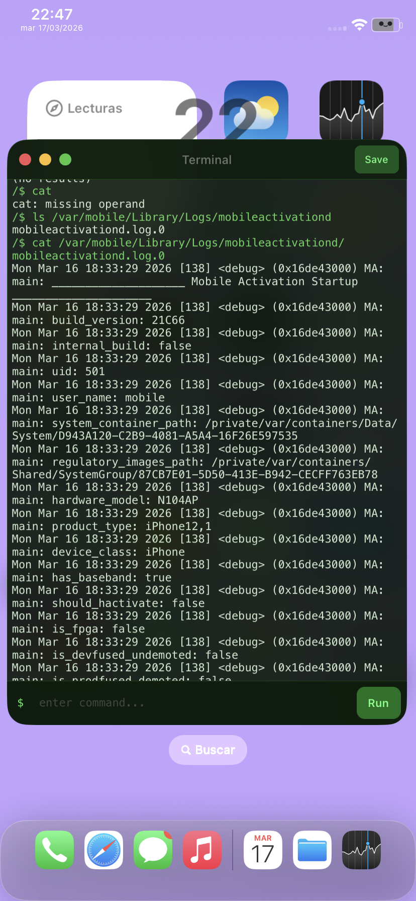
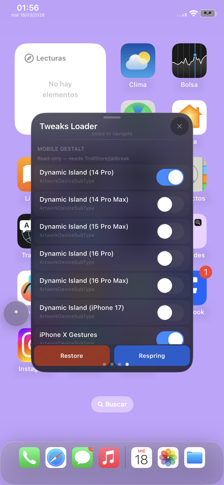
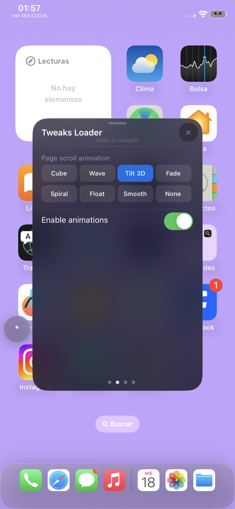
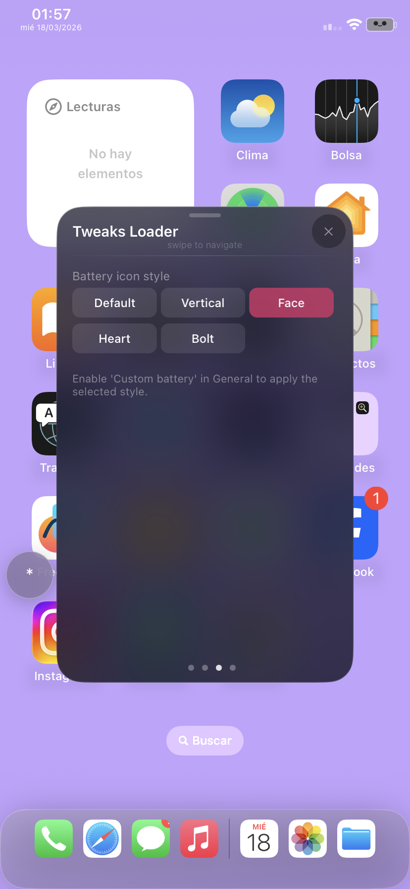
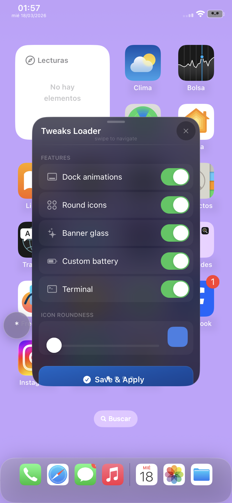
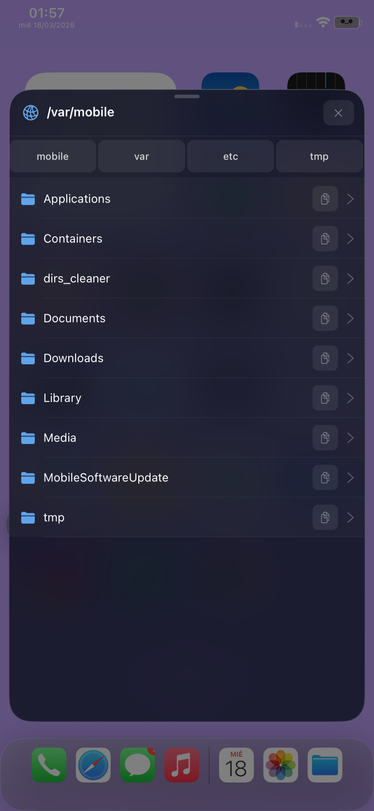
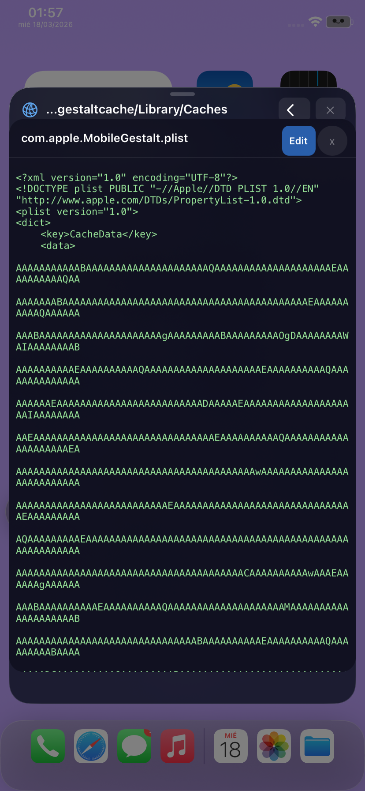
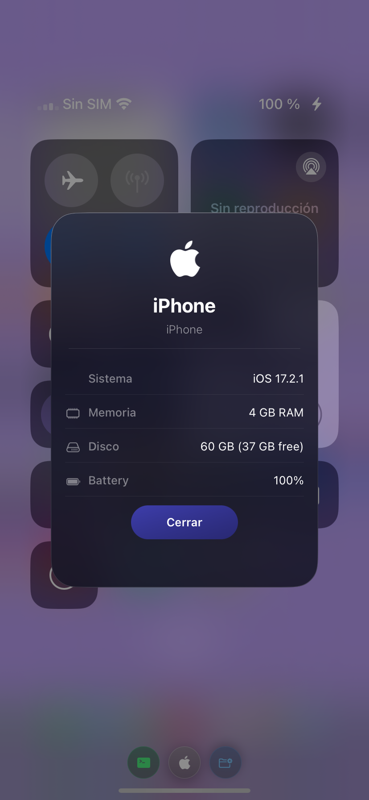
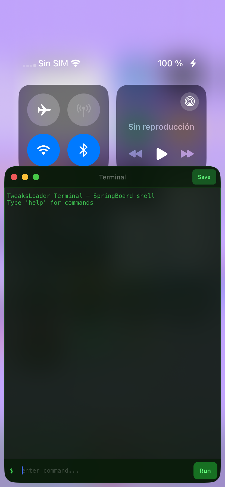
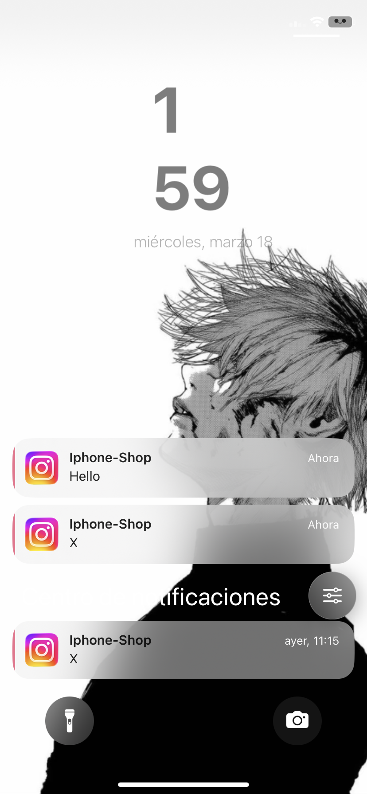
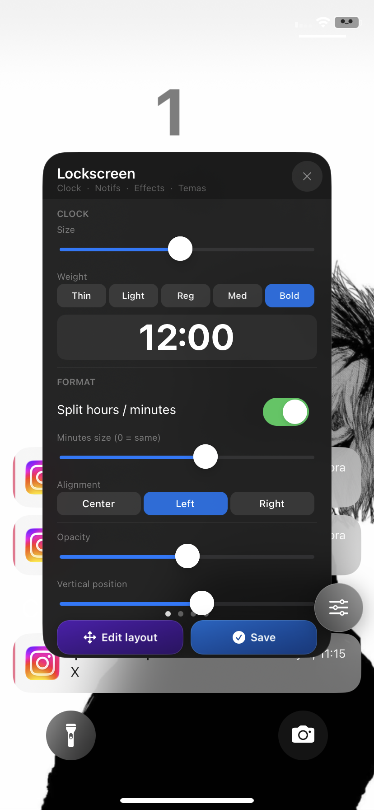
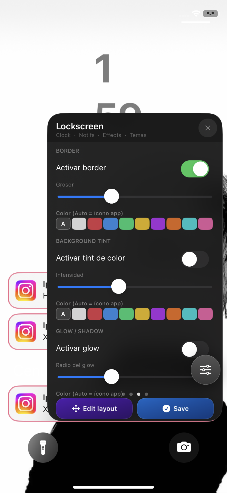
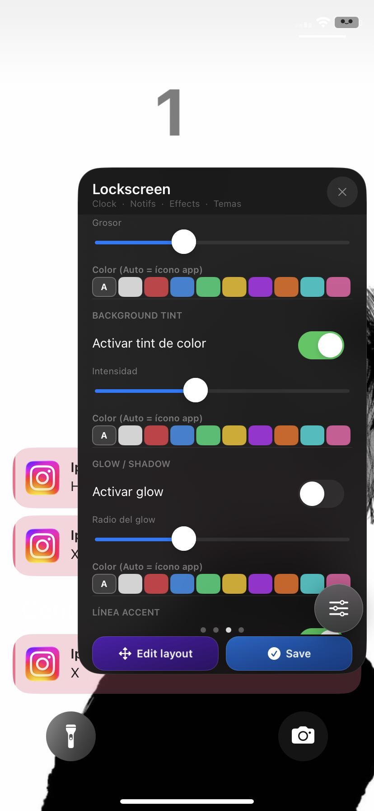

---

## Features

### Floating Dock
iPad-style floating dock on iPhone.

### Page Animations (Cylinder style)
8 home screen page-swipe animation styles — Cube, Wave, Tilt 3D, Fade, Spiral, Float, Smooth, None.

### Icon Roundness
Adjustable icon corner radius via slider.

### Custom Battery Styles
5 styles — Default, Vertical, Face, Kawaii, Heart, Bolt.

### Banner Glass
Liquid glass effect on notification banners.

### Lockscreen Customizer
Custom clock font, size, alignment, split mode, and date label.

### Control Center
Apple device info button and mini file browser button injected into the CC overlay.

### Mini File Browser (Fiddler-style)
Navigate the filesystem from SpringBoard. Read, edit, and save files — including binary plists decoded to XML. Long-press the floating button to open.

### Mini Terminal
SpringBoard-based terminal with native ObjC commands — no posix_spawn.  
Commands: `ls`, `cd`, `cat`, `find`, `grep`, `echo`, `ps`, `env`, `stat`, `uname`, `df`, `head`, `tail`, `mkdir`, `touch`, `rm`, `date`, `whoami`, `id`, `neofetch`, `clear`, `pwd`.  
Floating window, draggable, save log to disk.  
Enable via the Settings panel toggle.

### MobileGestalt Editor
Write directly to `com.apple.MobileGestalt.plist` from SpringBoard.  
Tweaks include:

- Dynamic Island (14 Pro / 14 Pro Max / 15 Pro Max / 16 Pro / 16 Pro Max)
- iPhone X Gestures
- Boot Chime
- 80% Charge Limit
- Tap to Wake (SE)
- Action Button
- Always On Display
- Apple Pencil Support
- Apple Internal (Metal HUD)
- Disable Wallpaper Parallax
- Collision SOS
- Camera Button (iPhone 16)
- Stage Manager
- iPadOS Full (CacheExtra + CacheData auto-patch)
- Apple Intelligence

Includes backup/restore and respring.

---

## Installation

Drop `TweaksLoader.dylib` into your Corunna dylib folder and inject into SpringBoard.

Requires **Corunna** or compatible exploit chain.  
iOS 13.0 – 17.2.1 | arm64

---

## Credits

Based on and inspired by:

- [zeroxjf/Coruna-Tweaks-Collection](https://github.com/zeroxjf/Coruna-Tweaks-Collection) — **zeroxjf**
- **FloatingDockXVI** — @EthanWhited
- **Cylinder Remade** — @ryannair05
- **FiveIconDock** — lunaynx

Thanks to all original tweak authors. This project would not exist without their work.

---

## Notes

- Source is not included for now soon i will update. dylib only.
- MobileGestalt tweaks require a respring to apply.
- Some tweaks (Stage Manager, iPadOS) are marked risky — use with caution.
